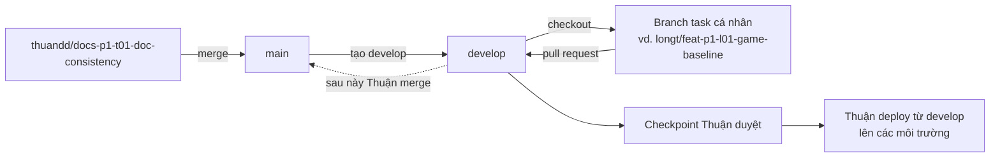

# Tài liệu dự án đấu giải OTT

> Cập nhật: 09/10/2026
>
> Đây là mục lục và quy tắc quản trị tài liệu chính thức. AI phải đọc file này trước khi kết hợp nhiều tài liệu.

## 1. Nguồn sự thật theo từng loại thông tin

Không dùng một thứ tự ưu tiên duy nhất cho mọi vấn đề. Mỗi nhóm thông tin có đúng một nguồn quyết định:

| Loại thông tin | Nguồn sự thật | Tài liệu khác được phép làm gì |
| --- | --- | --- |
| Cách AI/Git làm việc | `AGENTS.md`, `CLAUDE.md` | Chỉ giải thích thêm, không nới lỏng rules |
| Nghiệp vụ, luật game, phạm vi sản phẩm | [Đặc tả yêu cầu](tai-lieu-yeu-cau.md) | Plan/task chỉ triển khai một phần đã nêu |
| Quyết định kiến trúc đã chấp nhận | [ADRs](decisions/) | Tài liệu khác phải dẫn link, không quyết định lại |
| Engine API và Bot Protocol v1 | [Engine API](contracts/engine-api-v1.md), [Bot Protocol](contracts/bot-protocol-v1.md), [JSON Schema](contracts/bot-protocol-v1.schema.json) | Phần tóm tắt không được thay đổi field/semantics |
| Owner và ranh giới module | [Phân công Phase 1–2](team-assignment-phase-1-2.md) | AI context chỉ lọc phần liên quan cho từng người |
| Package, phiên bản công cụ, liên kết module và lệnh chạy | [Convention package module](conventions/module-package.md) | Task card chỉ dẫn lệnh theo convention, không pin phiên bản riêng |
| Dependency, checkpoint và trạng thái task | [Task checklist](../tasks/todo.md) | [Implementation plan](../tasks/plan.md) chỉ cung cấp bức tranh tổng thể |
| Cách một thành viên bắt đầu với AI | [AI context pack](ai-context/) | Không phải nguồn để thay đổi requirement/contract/task |

Nếu hai nguồn sự thật khác loại mâu thuẫn nhau, AI phải dừng trước khi code, trích đúng hai đoạn mâu thuẫn và chuyển owner quyết định. Không tự chọn tài liệu mới hơn, dài hơn hoặc thuận tiện hơn.

## 2. Trạng thái hiện tại

- `P1-T01` đã hoàn tất: ADR-0002, Engine API v1, Bot Protocol v1, schema và fixtures đã khóa.
- Bộ tài liệu khởi tạo được đưa vào `main`, sau đó Thuận tạo `develop` từ `main` mới; nhóm chỉ bắt đầu branch cá nhân sau khi `origin/develop` tồn tại.
- Ngày 2026-10-09 owner đổi theo lane và task ID được đánh lại theo owner mới: Long Trần làm core/protocol (`P1-L*`), Đỗ Khôi Nguyên làm bot Python và sandbox corpus (`P1-N*`, `P2-N01`), Phạm Tất Đạt làm MatchRunner và platform (`P1-D*`, `P2-D*`). Bảng ID cũ → mới: [`tasks/plan.md` mục 2.2.1](../tasks/plan.md).
- Workspace chung là `P1-T02` của Đinh Đức Thuận (thay `P1-D01` đã hủy), gộp sau Checkpoint `P1-B`; trước đó mỗi module tự khai báo dependency và chạy local.
- `P1-D02` (GamePort, BotPort và fakes) đã merge vào `develop`; `P1-D03` (MatchRunner happy path) của Đạt đã xong trên branch riêng, chưa merge. Task tiếp theo của lane Đạt là `P1-D04` (error, skip và cleanup).
- Source root là [`src/`](../src/README.md); hiện mới có layout, chưa có implementation.
- Kế hoạch GitNexus ngày 08/10 trong `docs/plans/` đã bị supersede; không dùng task ID hoặc owner trong tài liệu đó.

## 3. Quy trình branch thống nhất

| Thành viên | Prefix branch | Ví dụ |
| --- | --- | --- |
| Đinh Đức Thuận | `thuandd/` | `thuandd/feat-p2-t01-decisions` |
| Long Trần | `longt/` | `longt/feat-p1-l01-game-baseline` |
| Đỗ Khôi Nguyên | `nguyendk/` | `nguyendk/feat-p1-n01-bot-sdk` |
| Phạm Tất Đạt | `datpt/` | `datpt/feat-p1-d02-ports` |

Luồng branch:

1. Khởi tạo: branch tài liệu của Thuận merge vào `main`; Thuận tạo `develop` từ `main` và push `origin/develop`.
2. Phát triển: mỗi người tạo branch task từ `develop` mới nhất, làm và verify trên branch đó.
3. Tích hợp: mỗi task mở pull request vào `develop`.
4. Checkpoint: Thuận duyệt checkpoint trên `develop` sau khi các task liên quan đã merge và integration/E2E pass.
5. Triển khai: sau khi hoàn thiện, Thuận deploy từ `develop` lên các môi trường. `develop` luôn là branch có code mới nhất.
6. Đồng bộ `main`: về sau Thuận merge `develop` vào `main`; chưa có lịch cố định, chỉ làm khi Thuận quyết định.

Quy tắc:

- Feature dùng `<prefix>feat-<task-id>-<slug>`; fix dùng `<prefix>fix-<task-id>-<slug>`; tài liệu dùng `<prefix>docs-<task-id>-<slug>`.
- Mỗi task dùng một branch riêng tạo từ `develop`.
- Không code trực tiếp trên `main` hoặc `develop`.
- Mỗi pull request chỉ chứa một task và target `develop`.
- Chỉ Đinh Đức Thuận deploy, và chỉ từ `develop` sau khi integration/E2E và checkpoint pass.

## 4. Bắt đầu tại đây

1. [Hướng dẫn thành viên mới tham gia dự án với AI](huong-dan-tham-gia-du-an-voi-ai.md).
2. [Đặc tả yêu cầu hệ thống](tai-lieu-yeu-cau.md).
3. [Phân công Phase 1–2](team-assignment-phase-1-2.md).
4. [Implementation plan](../tasks/plan.md).
5. [Task checklist](../tasks/todo.md).

## 5. Quyết định và contract đã khóa

- [ADR-0001 — Stack và môi trường local](decisions/0001-technology-stack-and-local-development.md).
- [ADR-0002 — Engine và Bot Protocol v1](decisions/0002-phase-1-engine-and-bot-protocol-v1.md).
- [Engine API v1](contracts/engine-api-v1.md).
- [Bot Protocol v1](contracts/bot-protocol-v1.md), [JSON Schema](contracts/bot-protocol-v1.schema.json) và [fixtures](contracts/fixtures/).

## 6. AI Context Pack theo thành viên

- [Đinh Đức Thuận](ai-context/dinh-duc-thuan.md).
- [Long Trần](ai-context/long-tran.md).
- [Đỗ Khôi Nguyên](ai-context/do-khoi-nguyen.md).
- [Phạm Tất Đạt](ai-context/pham-tat-dat.md).

AI context pack là điểm bắt đầu theo vai trò. Task ID, dependency và trạng thái hoàn thành luôn phải đọc lại từ `tasks/todo.md`.

## 7. Chính sách cập nhật tài liệu liên tục

Tài liệu là một phần của implementation, không phải bước làm sau:

- Code và tài liệu liên quan phải thay đổi trong cùng task branch và cùng pull request.
- Thay đổi behavior/API/schema/config/command phải cập nhật requirement, contract, ADR, README hoặc runbook tương ứng.
- Task chỉ được tick `[x]` khi acceptance criteria, verification và phần tài liệu liên quan đều hoàn tất.
- Diagram chỉ gắn `✅` sau khi task/checkpoint đã được xác nhận; không suy đoán tiến độ từ file tồn tại hoặc báo cáo của AI.
- Sau khi merge vào `develop`, task owner hoặc Đinh Đức Thuận cập nhật trạng thái tập trung ngay, không chờ cuối phase.
- Handoff phải ghi `DOCS UPDATED` và liệt kê tài liệu đã sửa; nếu không cần sửa, ghi rõ lý do `not applicable`.
