# Hướng dẫn thành viên mới tham gia dự án với AI

> Trạng thái: **Đã tự động duyệt**
>
> Mức khuyến nghị: **HIGH RECOMMEND**
>
> Đối tượng: thành viên Dev, reviewer và người tiếp nhận bàn giao

## 1. Mục đích

Tài liệu này giúp một thành viên mới dùng AI để bắt đầu làm việc mà không cần đọc toàn bộ repository trong một lần.

Sau khi làm theo hướng dẫn, thành viên phải biết:

- Đọc tài liệu nào trước và tài liệu nào là nguồn sự thật.
- Chọn đúng task thuộc phạm vi của mình.
- Cung cấp đủ context cho AI nhưng không làm AI bị quá tải.
- Yêu cầu AI kiểm tra ảnh hưởng trước khi sửa code.
- Kiểm thử, review và bàn giao kết quả có bằng chứng.

AI là công cụ hỗ trợ của owner. AI không phải một owner độc lập và không được tự mở rộng phạm vi công việc.

## 2. Luồng làm việc tổng quát

```mermaid
flowchart LR
    A[Đọc rules] --> B[Chọn một task ID]
    B --> C[Kiểm tra dependency]
    C --> D[Mở phiên AI mới]
    D --> E[AI đọc context liên quan]
    E --> F[GitNexus impact]
    F --> G[Code, test và docs từng bước nhỏ]
    G --> H[Chạy verification của task]
    H --> I[Review diff và detect-changes]
    I --> J[Cập nhật task và bàn giao]
```



Nguyên tắc ngắn gọn: **một task ID, một phạm vi, một phiên AI tập trung, một bộ bằng chứng kiểm thử**.

## 3. Đọc tài liệu theo thứ tự nào

### 3.1 Khi mới vào dự án

Đọc theo thứ tự sau:

| Thứ tự | Tài liệu | Dùng để làm gì |
| --- | --- | --- |
| 1 | `AGENTS.md` hoặc `CLAUDE.md` | Quy tắc bắt buộc khi AI đọc, sửa và review repository |
| 2 | `docs/README.md` | Xác định nguồn sự thật cho đúng loại thông tin |
| 3 | `docs/tai-lieu-yeu-cau.md` | Hiểu mục tiêu hệ thống, luật nghiệp vụ và phạm vi |
| 4 | `docs/decisions/` và `docs/contracts/` liên quan | Biết quyết định kiến trúc và exact interface đã khóa |
| 5 | `docs/team-assignment-phase-1-2.md` | Biết phạm vi của từng thành viên và ranh giới không được sửa |
| 6 | `tasks/plan.md` | Hiểu dependency graph và checkpoint tổng thể |
| 7 | `tasks/todo.md` | Lấy task, trạng thái, dependency, acceptance criteria và verification chính thức |
| 8 | Source code và test liên quan | Hiểu implementation hiện tại trước khi sửa |

Không đưa toàn bộ tài liệu dài vào prompt nếu task chỉ liên quan một phần nhỏ. Yêu cầu AI đọc rules, task card và đúng section liên quan trong yêu cầu/kiến trúc.

### 3.2 Khi hai tài liệu mâu thuẫn

Không dùng một thứ tự tuyến tính cho mọi loại thông tin. Áp dụng bảng nguồn sự thật trong `docs/README.md`: requirements quyết định nghiệp vụ; ADR quyết định kiến trúc; contract/schema quyết định exact interface; `tasks/todo.md` quyết định trạng thái và dependency; rules quyết định cách làm việc.

Nếu hai nguồn thuộc các phạm vi trên vẫn mâu thuẫn, dừng task, trích đúng hai đoạn và gửi owner quyết định. AI không được tự chọn theo ngày, độ dài hoặc implementation hiện tại.

## 4. Chọn task trước khi mở AI

Mở `tasks/todo.md`, tìm task có đúng tên mình ở trường `Owner` và kiểm tra:

- Tất cả task trong `Dependencies` đã hoàn tất.
- Acceptance criteria đủ rõ để kiểm thử.
- Các file dự kiến không thuộc owner khác.
- Task không vượt quá 5 file; nếu vượt phải tách trước khi code.
- Không có thay đổi Bot Protocol chưa được Long làm owner và Nguyên, Đạt review.

Nếu dependency chưa hoàn tất, không code giả theo contract chưa khóa. Có thể chuẩn bị test case, mock hoặc fake nếu task cho phép.

## 5. Chuẩn bị máy và repository

Từ repository root:

```bash
pwd
git status --short
node .gitnexus/run.cjs status --repo .
```

Sau khi `P1-T02` hoàn tất (workspace gốc do Thuận gộp sau Checkpoint `P1-B`; trước đó chạy lệnh trong thư mục module của bạn), kiểm tra thêm:

```bash
node --version
npm ci
npm run typecheck
npm test
```

Nếu working tree đã có thay đổi không phải của mình, không xóa, reset hoặc ghi đè. Báo cho AI biết các file đó phải được giữ nguyên.

Không đưa secret, token, mật khẩu, `.env` thật hoặc dữ liệu riêng tư vào prompt AI.

### 5.1 Tạo branch riêng từ `develop`

| Thành viên | Prefix |
| --- | --- |
| Đinh Đức Thuận | `thuandd/` |
| Long Trần | `longt/` |
| Đỗ Khôi Nguyên | `nguyendk/` |
| Phạm Tất Đạt | `datpt/` |

Ví dụ cho task `P1-N01` của Nguyên:

```bash
git fetch origin
git switch develop
git pull --ff-only origin develop
git switch -c nguyendk/feat-p1-n01-bot-sdk
```

Feature dùng `<prefix>feat-<task-id>-<slug>`, fix dùng `<prefix>fix-<task-id>-<slug>`, tài liệu dùng `<prefix>docs-<task-id>-<slug>`. Nếu `origin/develop` chưa tồn tại hoặc working tree có thay đổi không rõ owner, dừng và báo; không tự reset. Pull request luôn target `develop`.

## 6. Prompt mở phiên AI đầu tiên

Copy mẫu dưới đây và thay nội dung trong dấu `<...>`:

```text
Tôi là <tên thành viên>, owner của task <TASK_ID>.

Repository:
/home/jits/Documents/UET/dau-giai-ott

Trước khi làm:
1. Đọc AGENTS.md hoặc CLAUDE.md.
2. Đọc docs/README.md và task <TASK_ID> trong tasks/todo.md.
3. Đọc phần liên quan trong docs/team-assignment-phase-1-2.md,
   docs/tai-lieu-yeu-cau.md và ADR liên quan.
4. Kiểm tra git status và giữ nguyên thay đổi không thuộc task.
5. Xác nhận branch đúng prefix owner, được tạo từ develop.
6. Dùng GitNexus để hiểu context và chạy impact trước khi sửa.

Phạm vi được phép:
- <file/module được phép sửa>

Ngoài phạm vi:
- <file/module không được sửa>
- Không thay đổi contract hoặc code của owner khác.
- Không commit hoặc deploy nếu tôi chưa yêu cầu.

Hãy bắt đầu bằng cách trả lời:
- Tóm tắt mục tiêu task.
- Dependency đã đủ hay chưa.
- Assumption và điểm chưa rõ.
- File dự kiến sửa.
- Kế hoạch nhỏ kèm lệnh kiểm thử.

Chưa sửa code cho tới khi hoàn tất phần kiểm tra trên.
```

Prompt này phù hợp cho Codex, Claude Code, Gemini CLI hoặc công cụ AI có quyền đọc repository. Nếu công cụ không hỗ trợ skill, vẫn yêu cầu nó làm đúng các bước trong prompt.

## 7. Prompt triển khai một task

Sau khi context và dependency đã đúng:

```text
Triển khai task <TASK_ID> đúng acceptance criteria trong tasks/todo.md.

Yêu cầu:
- Chỉ sửa các file đã thống nhất.
- Làm theo từng bước nhỏ và kiểm thử sau mỗi bước.
- Viết test trước hoặc cùng lúc với thay đổi hành vi.
- Không tự thay đổi public contract, dependency hoặc cấu trúc ngoài task.
- Chạy đúng verification command của task.
- Trước khi báo hoàn tất, review diff, chạy GitNexus detect-changes,
  liệt kê command đã chạy và kết quả thực tế.
- Không commit nếu tôi chưa yêu cầu.
```

Không giao một prompt kiểu “hãy làm toàn bộ Phase 1”. AI chỉ nên nhận một task ID hoặc một phần nhỏ hơn của task đó.

## 8. Prompt review và bàn giao

Khi implementation xong, mở một lượt review riêng:

```text
Review thay đổi của task <TASK_ID> theo các mục:
1. Có đúng acceptance criteria không?
2. Có sửa ngoài phạm vi hoặc file của owner khác không?
3. Có lỗi logic, security, process leak hoặc nondeterminism không?
4. Test có phủ happy path và lỗi chính không?
5. Verification nào đã chạy, kết quả thực tế là gì?
6. GitNexus detect-changes báo risk và affected process nào?

Nếu có lỗi, sửa trong phạm vi task và chạy lại verification.
Cuối cùng tạo handoff summary, không tự commit.
```

## 9. Skill nên yêu cầu AI sử dụng

Gọi skill bằng tên như `$test-driven-development`. Chỉ dùng skill phù hợp với task, không bật tất cả cùng lúc.

### 9.1 Skill chung

| Tình huống | Skill |
| --- | --- |
| Bắt đầu phiên mới, chọn workflow | `using-agent-skills`, `context-engineering` |
| Hiểu code hoặc luồng hiện tại | `gitnexus-exploring` |
| Kiểm tra phạm vi ảnh hưởng | `gitnexus-impact-analysis` |
| Triển khai thay đổi | `incremental-implementation` |
| Viết hoặc thay đổi logic | `test-driven-development` |
| Debug lỗi | `debugging-and-error-recovery` hoặc `systematic-debugging` |
| Review trước merge | `code-review-and-quality`, `verification-before-completion` |
| Branch/commit | `git-workflow-and-versioning` |
| Ghi quyết định/tài liệu | `documentation-and-adrs` |

### 9.2 Theo phạm vi thành viên

**Long Trần — Core Game và Bot Protocol**

- `api-and-interface-design`
- `spec-driven-development`
- `constraint-driven-development`
- `test-driven-development`

AI không được tạo một bộ luật riêng cho bot. API bot và Human-vs-Human phải dùng chung game rules.

**Đỗ Khôi Nguyên — Bot kiểm thử**

- `test-driven-development`
- `debugging-and-error-recovery`
- `security-and-hardening`

AI không được sửa core hoặc protocol. Bot lỗi chỉ được chạy trong test harness phù hợp; không chạy payload thử network, fork, CPU hoặc memory trực tiếp trên máy nếu chưa có sandbox.

**Phạm Tất Đạt — MatchRunner và platform local**

- `api-and-interface-design`
- `incremental-implementation`
- `test-driven-development`
- `security-and-hardening`
- `frontend-ui-engineering` khi bắt đầu React/Vite

AI phải dùng `FakeGame` và `ScriptedBot` trước khi core/bot thật sẵn sàng. Không đưa game rules vào MatchRunner.

**Đinh Đức Thuận — tích hợp, CI/CD và cloud**

- `ci-cd-and-automation`
- `observability-and-instrumentation`
- `shipping-and-launch`
- `security-and-hardening`
- `terraform-skill` nếu dùng Terraform/OpenTofu

Cloud là giai đoạn bàn giao riêng. Các task local của ba Dev không được tự thêm credential hoặc cấu hình production.

## 10. Quy tắc GitNexus bắt buộc

Trước khi sửa một symbol hoặc file đã tồn tại:

```bash
node .gitnexus/run.cjs impact "<symbol-hoặc-file>" --direction upstream --repo .
```

- `HIGH` hoặc `CRITICAL`: dừng và báo owner trước khi sửa.
- `UNKNOWN`: chưa thể kết luận an toàn; dùng text search xác minh reference.
- Không dùng `grep`/`rg` thay cho graph analysis; text search chỉ bổ sung khi graph không đủ.

Trước khi commit hoặc bàn giao:

```bash
node .gitnexus/run.cjs detect-changes --scope all --repo .
```

Nếu kết quả `partial` hoặc `truncated`, phải chạy lại. Không coi zero affected là an toàn nếu index không nhìn thấy file/symbol mới.

## 11. Definition of Done của một task

Task chỉ được đánh dấu hoàn tất khi:

- Đạt toàn bộ acceptance criteria trong `tasks/todo.md`.
- Chạy được độc lập trên localhost.
- Có test happy path và lỗi chính.
- Verification command pass và có output thực tế.
- Không sửa phạm vi của owner khác khi chưa trao đổi.
- Không chứa secret hoặc cấu hình cloud ngoài phạm vi.
- Tài liệu chạy hoặc README được cập nhật nếu behavior/public contract thay đổi.
- Code và docs liên quan nằm trong cùng task branch/PR; không để lại lời hứa cập nhật tài liệu sau.
- Diff đã được review; GitNexus `detect-changes` đã chạy.
- Các giới hạn hoặc rủi ro còn lại được ghi rõ trong handoff.

Không chấp nhận các câu như “chắc là pass”, “code có vẻ đúng” hoặc “AI nói đã xong” thay cho bằng chứng kiểm thử.

## 12. Mẫu handoff sau mỗi phiên AI

```text
TASK: <TASK_ID>
OWNER: <tên>
STATUS: done | partial | blocked

Đã làm:
- ...

File đã thay đổi:
- ...

Verification đã chạy:
- <command> → PASS/FAIL

GitNexus:
- Risk: ...
- Affected process/module: ...

Quyết định hoặc assumption:
- ...

Việc còn lại/rủi ro:
- ...

Task tiếp theo có thể mở:
- ...

Git status:
- committed | uncommitted

DOCS UPDATED:
- <file đã cập nhật hoặc not applicable kèm lý do>
```

Lưu handoff trong PR/issue hoặc nơi nhóm thống nhất. Không chỉ để thông tin trong conversation vì phiên AI sau có thể không có lịch sử cũ.

## 13. Khi nào nên mở phiên AI mới

Mở phiên mới khi:

- Chuyển sang task ID khác.
- Chuyển sang module hoặc owner khác.
- Conversation đã chứa nhiều thử nghiệm thất bại hoặc log không còn liên quan.
- AI bắt đầu nhầm contract, file hoặc phạm vi.
- Task hiện tại đã hoàn tất và có handoff.

Phiên mới phải đọc lại rules, task card, `git status` và handoff gần nhất. Không giả định AI nhớ nội dung của phiên trước.

## 14. Các lỗi cần tránh

- Giao cho AI nhiều task song song trên cùng module.
- Cho AI tự chọn yêu cầu khi hai tài liệu mâu thuẫn.
- Đưa toàn bộ repository vào context dù chỉ sửa một file.
- Cho AI sửa protocol/core thuộc owner khác để “làm test pass nhanh”.
- Chạy bot độc hại ngoài sandbox.
- Cho AI tự commit, push, merge hoặc deploy khi chưa được yêu cầu.
- Tin vào báo cáo hoàn thành mà không có test/build output.
- Đưa secret hoặc `.env` thật vào prompt.
- Reset hoặc xóa thay đổi đang có trong working tree.

## 15. Checklist 5 phút cho thành viên mới

- [ ] Tôi đã đọc `AGENTS.md` hoặc `CLAUDE.md`.
- [ ] Tôi đã đọc `docs/README.md` và biết nguồn sự thật của task.
- [ ] Tôi biết phạm vi của mình trong tài liệu phân công.
- [ ] Tôi đã chọn đúng một task ID trong `tasks/todo.md`.
- [ ] Dependency của task đã hoàn tất.
- [ ] Tôi đang ở branch đúng prefix của mình, tạo từ `develop`.
- [ ] Tôi đã kiểm tra `git status` và không ghi đè thay đổi của người khác.
- [ ] Prompt AI nêu rõ file được sửa và phần ngoài phạm vi.
- [ ] AI sẽ chạy GitNexus impact trước khi edit.
- [ ] Tôi biết verification command và Definition of Done của task.
- [ ] Tôi sẽ review diff và bằng chứng test trước khi đánh dấu hoàn tất.

Nếu đủ các mục trên, thành viên có thể bắt đầu phiên AI đầu tiên.
