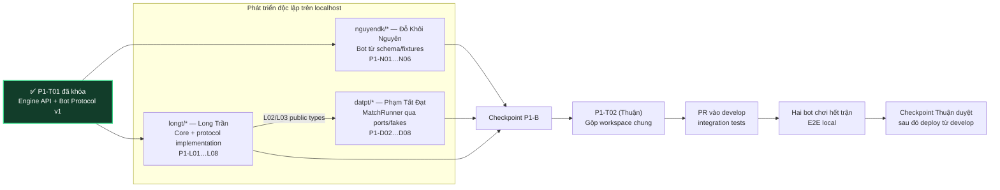

# Đặc tả công việc cho nhóm Dev — Phase 1 và Phase 2

> Owner/range trong file này là nguồn phân công chính thức. Task ID, dependency và trạng thái thực tế phải đọc từ `tasks/todo.md`; contract exact phải đọc từ `docs/contracts/`.

## 1. Mục tiêu phân công

Ba thành viên Dev phát triển độc lập trên `localhost`:

- **Long Trần:** triển khai lại hành vi game Human-vs-Human tham chiếu thành core thuần để bot có thể điều khiển game và là owner chính thức của Bot Protocol v1.
- **Đỗ Khôi Nguyên:** viết các bot mẫu và bot lỗi để kiểm thử.
- **Phạm Tất Đạt:** viết chương trình chạy trận, nối core với hai bot và kiểm thử end-to-end local.

**Đinh Đức Thuận** nhận phiên bản local hoàn chỉnh để làm CI/CD và triển khai cloud. Phần DevOps không nằm trong phạm vi triển khai của ba Dev.

## 2. Hiện trạng đã kiểm tra

Core Human-vs-Human tham chiếu tại:

- Repository: [sock1000kg/rock-paper-scissor](https://github.com/sock1000kg/rock-paper-scissor)
- Commit cố định: `2956f1601365274eb34d623a9c908900bf43baab`

Core hiện đã có:

- `createInitialGame(...)`: tạo game ban đầu.
- `getLegalMoves(state, pieceId)`: lấy nước đi hợp lệ.
- `applyMove(state, playerId, pieceId, to)`: áp dụng nước đi.
- Luật Búa–Bao–Kéo, bàn 9×9, map có chướng ngại vật và hai điều kiện thắng.
- Unit test cơ bản cho luật game.

Các điểm chưa phù hợp với bot:

- `applyMove` nhận `playerId` của người chơi thay vì `side` của bot.
- State còn chứa dữ liệu phòng Human-vs-Human như `roomId`, `players`, `hostId`.
- Chưa có API bỏ lượt khi bot timeout hoặc gửi action lỗi.
- Chưa có `turnNumber`, `maxTurns`, kết quả hòa và `finalStateHash`.
- Chưa có protocol chính thức giữa Engine và tiến trình bot.
- Chưa có chương trình khởi chạy hai bot và điều phối toàn bộ trận đấu.

> Quyết định đã khóa: chỉ dùng repository trên làm nguồn đối chiếu hành vi tại commit đã pin; không sao chép source vì repository tham chiếu chưa công bố license. Xem `docs/decisions/0002-phase-1-engine-and-bot-protocol-v1.md`.

## 3. Ranh giới công việc

### Long Trần — Core Game và Bot Protocol Owner

- Core game và API thuần TypeScript.
- Khả năng tương thích với màn Human-vs-Human hiện có.
- Schema và tài liệu Bot Protocol v1.
- Unit test và contract fixture thuộc core/protocol.

Long Trần không làm bot Python, process runner, Fastify API, database, queue, UI hoặc cloud.

### Đỗ Khôi Nguyên chỉ làm

- Bot Python dùng để kiểm thử protocol và trận đấu.
- Bot hợp lệ, bot có chiến thuật đơn giản và các bot cố tình gây lỗi.
- Test protocol ở phía bot.

Đỗ Khôi Nguyên không sửa luật game. Nếu phát hiện core hoặc protocol sai, tạo issue/test case và gửi Long xử lý.

### Phạm Tất Đạt làm

- MatchRunner điều phối một trận.
- BotProcess adapter để chạy hai tiến trình bot.
- Timeout, parse NDJSON, dọn tiến trình và event log.
- CLI và E2E local.
- Sang Phase 2: PostgreSQL, Redis/BullMQ, MinIO, Fastify API và React/Vite.

Đạt không sửa luật trong core và không viết chiến thuật bot.

## 4. Workflow

### 4.1 Branch theo từng người

| Thành viên | Prefix | Ví dụ |
| --- | --- | --- |
| Đinh Đức Thuận | `thuandd/` | `thuandd/feat-p2-t01-decisions` |
| Long Trần | `longt/` | `longt/feat-p1-l01-game-baseline` |
| Đỗ Khôi Nguyên | `nguyendk/` | `nguyendk/feat-p1-n01-bot-sdk` |
| Phạm Tất Đạt | `datpt/` | `datpt/feat-p1-d02-ports` |

`develop` được tạo từ `main` sau khi bộ tài liệu khởi tạo vào `main`. Mỗi task dùng một branch riêng tạo từ `develop`, theo mẫu `<prefix>feat-<task-id>-<slug>`. Pull request target `develop`; checkpoint và deploy đều thực hiện từ `develop`; không code trực tiếp trên `main`/`develop` và không trộn nhiều task trong một branch.

### 4.2 Luồng phát triển và tích hợp



`✅` chỉ gắn cho node có task/checkpoint đã hoàn tất trong `tasks/todo.md` và có bằng chứng verification. Hiện tại chỉ `P1-T01` hoàn tất; `P1-T02` (Thuận, gộp sau Checkpoint `P1-B`) chưa có workspace artifact nên chưa được tick.

Các điểm đồng bộ bắt buộc:

1. `origin/develop` phải tồn tại trước khi mở branch cá nhân.
2. Long không chờ workspace gốc; Đạt chờ public types `P1-L02/P1-L03`; Nguyên bắt đầu từ schema/fixtures đã khóa.
3. Cả ba lane merge vào `develop` để chạy E2E cuối Phase 1.

Trong thời gian code, Nguyên và Đạt dùng fixture, mock hoặc fake; không gọi service chạy trên máy của Long.

### 4.3 Cập nhật tài liệu liên tục

- Mỗi thay đổi behavior, public API, schema, command, config hoặc cách chạy phải cập nhật tài liệu liên quan ngay trên cùng branch với code.
- Trước khi mở PR, task owner cập nhật README/runbook/contract/ADR cần thiết và ghi verification thực tế trong handoff.
- Không tick task khi mới viết xong code. Chỉ đổi `[ ]` thành `[x]` sau khi acceptance criteria và verification pass.
- Sau khi task/checkpoint được xác nhận trên `develop`, owner hoặc Đinh Đức Thuận cập nhật `tasks/todo.md` và thêm `✅` vào node tương ứng trong diagram.
- Nếu code và docs khác nhau, task chưa hoàn tất; không merge bằng cách hứa “cập nhật docs sau”.

## 5. Contract phải chốt trước khi code

Thời gian mục tiêu: tối đa một buổi làm việc.

**Trạng thái: ĐÃ KHÓA ngày 09/10/2026.** Contract chính thức:

- `docs/contracts/engine-api-v1.md`
- `docs/contracts/bot-protocol-v1.md`
- `docs/contracts/bot-protocol-v1.schema.json`
- `docs/decisions/0002-phase-1-engine-and-bot-protocol-v1.md`

Các đoạn dưới đây là bản tóm tắt. Khi có khác biệt, contract chính thức ở trên được ưu tiên.

### 5.1 Engine API

API đã khóa cho bot:

```ts
interface GameAction {
  pieceId: string;
  to: Position;
}

type ActionErrorCode =
  | 'GAME_NOT_PLAYING'
  | 'NOT_YOUR_TURN'
  | 'PIECE_NOT_FOUND'
  | 'NOT_YOUR_PIECE'
  | 'ILLEGAL_MOVE';

createGame(config: GameConfig): GameState;
listLegalActions(state: GameState, side: PlayerSide): GameAction[];
applyAction(state: GameState, side: PlayerSide, action: GameAction): TransitionResult;
skipTurn(state: GameState, side: PlayerSide, reason: SkipReason): TransitionResult;
forfeitGame(state: GameState, forfeitedSide: PlayerSide, fault: ProcessFaultCode | SkipReason): TransitionResult;
getGameResult(state: GameState): GameResult | null;
hashGameState(state: GameState): string;
```

Quy tắc tương thích:

- Giữ `applyMove(state, playerId, ...)` cho Human-vs-Human.
- `applyMove` chỉ tìm `side` từ `playerId`, sau đó gọi chung `applyAction`.
- Không được duy trì hai bộ luật riêng cho human và bot.
- Core không import React, Fastify, BullMQ, Docker hoặc code chạy process.

### 5.2 Bot Protocol v1

Protocol dùng STDIO và NDJSON. Mỗi message là một JSON object trên đúng một dòng.

- **Owner thiết kế và triển khai:** Long Trần.
- **Consumer/reviewer:** Đỗ Khôi Nguyên và Phạm Tất Đạt.
- Nguyên và Đạt không tự thay đổi protocol. Mọi thay đổi schema, message hoặc error code phải được Long cập nhật vào tài liệu, JSON Schema và fixture trong cùng pull request.

| Message | Hướng | Mục đích | Trường bắt buộc |
| --- | --- | --- | --- |
| `INIT` | Engine → Bot | Khởi tạo bot một lần | `protocolVersion`, `matchId`, `side`, `map`, `limits` |
| `STATE_UPDATE` | Engine → Bot | Giao trạng thái cho lượt hiện tại | `matchId`, `turnId`, `state`, `legalActions` |
| `ACTION` | Bot → Engine | Bot chọn một nước đi | `matchId`, `turnId`, `action` |
| `TURN_RESULT` | Engine → Bot | Thông báo action được áp dụng hoặc bị skip | `turnId`, `outcome`, `errorCode`, `revision` |
| `MATCH_RESULT` | Engine → Bot | Thông báo trận kết thúc | `winnerSide`, `reason`, `turnCount`, `finalStateHash` |

Quy tắc protocol:

- Mọi message có `type`, `protocolVersion: 1` và `matchId`.
- `turnId` tăng theo lượt và không được dùng lại.
- `STATE_UPDATE` chỉ gửi cho bot đang đến lượt.
- `legalActions` được gửi kèm để Nguyên không phải viết lại toàn bộ luật trong bot test.
- Engine vẫn phải validate lại action; bot không bao giờ là nguồn sự thật.
- Bot chỉ ghi message protocol vào `stdout`; log chẩn đoán ghi vào `stderr`.
- Sai JSON, sai schema, sai `matchId`, sai `turnId`, quá kích thước hoặc timeout đều tạo `TURN_SKIPPED`.
- Baseline: startup 5 giây, mỗi lượt 3 giây, message 65.536 byte, stderr 1 MiB và tối đa 200 lượt.
- Lỗi theo lượt dẫn đến forfeit khi đạt 3 lỗi liên tiếp hoặc 5 lỗi tổng.
- Crash, EOF, spawn failure, quota/resource hoặc sandbox violation dẫn đến forfeit ngay.
- Response đến muộn không được dùng cho lượt kế tiếp.
- Schema phải có fixture JSON hợp lệ và không hợp lệ để cả ba người dùng chung.

Artifacts đã phát hành tại `P1-T01` và là input cho implementation:

- `docs/contracts/bot-protocol-v1.md`.
- `docs/contracts/bot-protocol-v1.schema.json` cho năm loại message.
- Fixtures tại `docs/contracts/fixtures/`.
- Danh sách error code cố định trong contract và schema.

## 6. Công việc chi tiết — Long Trần

### 6.1 Triển khai behavior core theo đặc tả

Công việc:

- Dùng commit tham chiếu đã pin để đối chiếu hành vi game.
- Tự triển khai types, engine, map và test trong `src/game-core/` theo contract đã khóa.
- Không sao chép source, UI hoặc multiplayer từ repository tham chiếu.
- Ghi rõ provenance trong tài liệu để có thể kiểm tra lại nguồn hành vi.

Hoàn thành khi:

- Core build được bằng Node.js 22 và TypeScript.
- Test behavior baseline chạy được.
- Không thay đổi luật game ngoài yêu cầu đã duyệt.

### 6.2 Tách API điều khiển theo side

Công việc:

- Thêm `GameAction`.
- Thêm `applyAction(state, side, action)`.
- Chuyển logic luật hiện tại vào đường xử lý chung.
- Giữ `applyMove(...playerId...)` làm adapter cho Human-vs-Human.
- Bảo đảm state đầu vào không bị mutate.

Hoàn thành khi:

- Human-vs-Human vẫn hoạt động như trước.
- Bot có thể thực hiện action chỉ bằng `side`, không cần fake `playerId`.
- Cùng state và action luôn trả cùng kết quả.

### 6.3 Hoàn thiện vòng đời một lượt

Công việc:

- Thêm `turnNumber` và `maxTurns`.
- Thêm `skipTurn` cho timeout/action lỗi.
- Khi skip: bàn cờ không đổi, revision và turnNumber tăng 1, lượt chuyển sang đối thủ.
- Kết thúc hòa với lý do `TURN_LIMIT` khi đạt maxTurns.
- Chuẩn hóa `GameResult` dùng `winnerSide` thay vì phụ thuộc `winnerId`.

Hoàn thành khi:

- Nước đi hợp lệ và lượt bị skip đều có transition rõ ràng.
- Action bị từ chối không làm thay đổi state.
- Hết lượt tạo kết quả hòa đúng một lần.

### 6.4 Bổ sung event và hash

Công việc:

- Mỗi transition sinh event đủ để replay.
- Event có revision, turnId, side, action/outcome và error code nếu có.
- Tạo canonical state trước khi hash.
- Tính `finalStateHash` ổn định, không phụ thuộc thứ tự key hoặc thời gian máy.

Hoàn thành khi:

- Chạy lại cùng config và cùng chuỗi action cho cùng event sequence và hash.
- Replay từ initial state và event log cho ra đúng final state.

### 6.5 Sở hữu và triển khai Bot Protocol v1

Công việc:

- Viết tài liệu năm loại message.
- Viết JSON Schema và TypeScript types tương ứng.
- Quy định kích thước message, cách xử lý extra field và error code.
- Tạo fixture chung cho Nguyên và Đạt.
- Review protocol với Nguyên và Đạt trước khi merge.
- Chịu trách nhiệm xử lý các yêu cầu thay đổi protocol do Nguyên hoặc Đạt phát hiện trong quá trình tích hợp.

Hoàn thành khi:

- Nguyên có thể viết bot mà không đọc source core.
- Đạt có thể viết MatchRunner bằng fake core.
- Mọi fixture được validate tự động.

### 6.6 Test bắt buộc

- Giữ toàn bộ test luật hiện có.
- Test Human-vs-Human adapter và Bot API cho cùng kết quả.
- Test 8 hướng, biên, chướng ngại và mọi quan hệ ăn quân.
- Test sai lượt, sai side, sai piece và illegal move.
- Test skip, maxTurns, draw, winnerSide, event log và finalStateHash.
- Test input không đổi sau cả transition thành công và thất bại.

Đầu ra cuối cùng của Long:

- Core game thuần TypeScript.
- API cho human và bot dùng chung một bộ luật.
- Bot Protocol v1 cùng schema/fixture.
- Unit test và tài liệu sử dụng API.

## 7. Công việc chi tiết — Đỗ Khôi Nguyên

### 7.1 Viết Bot SDK tối thiểu bằng Python

Công việc:

- Đọc từng dòng NDJSON từ `stdin`.
- Parse và kiểm tra message cơ bản.
- Gọi hàm chiến thuật khi nhận `STATE_UPDATE`.
- Ghi đúng một `ACTION` lên `stdout`.
- Ghi log vào `stderr`.
- Không dùng network hoặc dữ liệu ngoài message được nhận.

Hoàn thành khi:

- SDK xử lý được toàn bộ fixture hợp lệ.
- Không có text thừa trên `stdout`.
- Sai message đầu vào làm bot thoát với lỗi rõ ràng, không treo.

### 7.2 Bot hợp lệ để chạy trận

Tạo ít nhất hai bot:

- **FirstLegalBot:** luôn chọn action hợp lệ đầu tiên theo thứ tự cố định.
- **CaptureFirstBot:** ưu tiên ăn quân, nếu không có thì chọn action hợp lệ đầu tiên.

Quy tắc:

- Không dùng random; hoặc nếu cần thì seed phải nhận từ `INIT`.
- Cùng state phải trả cùng action.
- Phản hồi trong thời gian nhỏ hơn nhiều so với timeout mặc định 3 giây.

Hoàn thành khi:

- Hai bot có thể chơi hết một trận mà không cần người thao tác.
- Chạy lại cùng match config cho cùng chuỗi action.

### 7.3 Bot lỗi để kiểm thử hệ thống

Tạo các chương trình độc lập:

- `InvalidJsonBot`: trả JSON hỏng.
- `IllegalActionBot`: trả action không hợp lệ.
- `TimeoutBot`: không phản hồi trong thời hạn.
- `CrashBot`: thoát giữa trận.
- `WrongTurnBot`: trả sai turnId.
- `OversizeOutputBot`: ghi message vượt giới hạn.

Hoàn thành khi:

- Mỗi bot chỉ gây đúng một loại lỗi.
- Đạt có thể dùng từng bot làm fixture E2E.
- Tên bot và hành vi được ghi trong README.

### 7.4 Contract test phía bot

Công việc:

- Chạy bot với fixture `INIT` và `STATE_UPDATE`.
- Parse lại `ACTION` do bot trả về.
- Validate output bằng schema của Long.
- Test bot không trả hai action cho một turnId.
- Test bot bỏ qua hoặc dừng đúng cách sau `MATCH_RESULT`.

Đầu ra cuối cùng của Nguyên:

- Python Bot SDK tối thiểu.
- Hai bot hợp lệ.
- Sáu bot lỗi.
- Unit/contract test và hướng dẫn chạy từng bot.

## 8. Công việc chi tiết — Phạm Tất Đạt

### 8.1 Đạt có bị vướng không?

**Có vướng ở bước tích hợp cuối, nhưng không cần ngồi chờ.**

Đạt cần contract của Long, nhưng không cần chờ core implementation. Sau khi Engine API và Bot Protocol v1 được khóa, Đạt dùng `FakeGame` và `ScriptedBot` để phát triển MatchRunner độc lập.

Nếu không giao MatchRunner cho Đạt, Phase 1 đang thiếu owner cho phần nối core với bot.

### 8.2 Định nghĩa port để làm việc bằng fake

Đề xuất:

```ts
interface GamePort {
  create(config: GameConfig): GameState;
  viewFor(state: GameState, side: PlayerSide): BotState;
  apply(state: GameState, side: PlayerSide, action: GameAction): TransitionResult;
  skip(state: GameState, side: PlayerSide, reason: SkipReason): TransitionResult;
  result(state: GameState): GameResult | null;
}

interface BotPort {
  start(init: InitMessage): Promise<void>;
  requestAction(update: StateUpdateMessage, timeoutMs: number): Promise<ActionMessage>;
  sendTurnResult(result: TurnResultMessage): Promise<void>;
  finish(result: MatchResultMessage): Promise<void>;
  stop(): Promise<void>;
}
```

Đạt viết MatchRunner chỉ phụ thuộc hai port này. Adapter core thật và process thật được nối sau.

### 8.3 Viết MatchRunner bằng fake

Công việc:

- Khởi tạo game.
- Xác định bot đang đến lượt.
- Gửi state update và chờ action.
- Gọi GamePort để apply hoặc skip.
- Gửi turn result.
- Lặp đến khi có match result.
- Luôn đóng cả hai bot trong `finally`.

Hoàn thành khi:

- FakeGame và hai ScriptedBot chạy được một trận trong memory.
- Timeout, action lỗi và bot throw đều được chuyển thành kết quả đúng.
- Cleanup luôn được gọi kể cả khi runner lỗi.

### 8.4 Viết BotProcess adapter

Công việc:

- Spawn bot Python bằng command/args đã cấu hình.
- Gửi NDJSON vào `stdin`.
- Đọc `stdout` theo từng dòng với buffer có giới hạn.
- Thu `stderr` riêng và giới hạn dung lượng.
- Dùng monotonic timeout cho từng lượt.
- Từ chối sai matchId, turnId, schema hoặc message quá lớn.
- Dọn toàn bộ process khi bot crash, timeout nghiêm trọng hoặc trận kết thúc.

Hoàn thành khi:

- Không có process bot còn sống sau trận.
- Response trễ không lọt sang lượt sau.
- Bot lỗi của Nguyên sinh đúng loại event/kết quả.

### 8.5 Event log và replay local

Công việc:

- Ghi metadata match, engine version, protocol version và bot command.
- Ghi event theo đúng thứ tự revision.
- Ghi kết quả và finalStateHash.
- Không ghi source bot, secret hoặc stdout thừa vào replay.
- Có hàm đọc event log để tái tạo và kiểm tra final hash.

Hoàn thành khi:

- Replay một trận hợp lệ cho đúng final state.
- Sửa một event làm kiểm tra hash thất bại.

### 8.6 CLI chạy trận

CLI tối thiểu:

```text
run-match --bot-x <command> --bot-o <command> --map <map-id> --max-turns <n>
```

Output:

- Exit code `0` khi runner hoàn tất và sinh kết quả hợp lệ.
- Exit code khác `0` khi lỗi hạ tầng làm trận không thể hoàn tất.
- In đường dẫn event log và tóm tắt kết quả.

Hoàn thành khi:

- Một lệnh chạy được FirstLegalBot đấu CaptureFirstBot trên localhost.
- Không cần PostgreSQL, Redis, MinIO hoặc cloud trong Phase 1.

### 8.7 E2E Phase 1

Kịch bản bắt buộc:

- Hai bot hợp lệ chơi hết trận.
- Bot gửi JSON sai bị skip nhưng trận tiếp tục.
- Bot gửi action sai làm state bàn cờ không đổi.
- Bot timeout bị skip và không làm treo runner.
- Bot crash được dọn process và áp dụng policy đã chốt.
- Cùng input cho cùng event sequence và finalStateHash.

Đầu ra cuối cùng của Đạt:

- MatchRunner.
- BotProcess adapter.
- CLI local.
- Event log/replay.
- E2E sử dụng bot của Nguyên và core của Long.

## 9. Dependency của Đạt

| Công việc của Đạt | Phụ thuộc | Có thể bắt đầu ngay? |
| --- | --- | --- |
| Workspace (`P1-D01` đã hủy) | Thuận làm dưới ID `P1-T02`; sau Checkpoint `P1-B` | Không thuộc lane runner |
| GamePort/BotPort | public types `P1-L02/P1-L03` | Chưa; dùng thời gian chờ để review contract |
| MatchRunner với fake | `P1-D02` | Có sau ports; không cần core thật |
| BotProcess adapter | `P1-D02` | Có sau ports; protocol docs đã khóa |
| CLI shell | `P1-D06`, `P1-D07` | Chưa; làm đúng dependency task |
| E2E bot hợp lệ | Core của Long + bot của Nguyên | Không, đây là bước tích hợp |
| E2E lỗi bot | Các bot lỗi của Nguyên | Không, nhưng có thể dùng fixture tạm |
| Phase 2 API lưu kết quả | `P1-D11`, `P2-T01`, database foundation | Không mở trong Phase 1 |

Như vậy Đạt không bị block toàn bộ. Chỉ E2E cuối cùng phụ thuộc hai người còn lại.

## 10. Phase 2 sau khi Phase 1 đạt

### Long Trần

- Chỉ bảo trì core và protocol.
- Hỗ trợ map động hoặc protocol version mới khi có yêu cầu đã duyệt.
- Không nhận phần tài khoản, submission, queue, Elo hoặc web.

### Đỗ Khôi Nguyên

- Dùng bộ bot lỗi để kiểm thử sandbox và worker.
- Bổ sung bot canary dùng trước mỗi đợt thi đấu.
- Duy trì compatibility test với Bot Protocol v1.

### Phạm Tất Đạt

- Docker Compose local cho PostgreSQL, Redis và MinIO.
- Schema/migration cho identity, Team, Submission, Match, Attempt, Event và Result.
- Authentication/RBAC server-side theo policy được Thuận khóa tại `P2-T01`.
- Fastify API cho đội, nộp bot, tạo/xem trận và kết quả.
- MinIO adapter lưu bot, map và replay.
- Sandbox local để chạy artifact bot theo giới hạn đã chốt.
- Redis/BullMQ adapter đưa MatchJob vào MatchRunner.
- Xếp lịch series, chốt MatchResult, tính Elo và ghi rating ledger.
- React/Vite cho nộp bot, lịch, kết quả và bảng xếp hạng.

### Cảnh báo tải công việc Phase 2

Nếu giữ Long chỉ làm core và Nguyên chỉ làm bot test, toàn bộ platform Phase 2 dồn vào Đạt. Đạt không bị chặn kỹ thuật, nhưng sẽ trở thành điểm nghẽn về khối lượng công việc.

Khi chưa chia thêm owner, Đạt phải làm Phase 2 theo thứ tự:

1. Local Docker Compose và decision gate `P2-T01`.
2. Data model, authentication/RBAC, Team/Submission API và MinIO.
3. Queue/worker và sandbox.
4. Match finalization, scheduling và Elo.
5. React/Vite UI.

Năm nhóm việc trên không nên chạy đồng thời bởi một người. Sau khi Phase 1 hoàn tất, cả nhóm cần quyết định chia bớt sandbox/worker hoặc scheduling/Elo, hoặc chấp nhận Phase 2 triển khai tuần tự.

Phần Đạt có thể làm độc lập ngay ở Phase 2:

- Local Docker Compose.
- Team/Submission schema và CRUD.
- Upload artifact vào MinIO.
- UI dùng mock API.

Phần Đạt phải chờ contract:

- Authentication/RBAC: chờ identity policy được khóa tại `P2-T01`.
- Lưu MatchResult: chờ schema kết quả của Phase 1.
- Gọi worker: chờ MatchJob payload được chốt.
- Sandbox, series và bảng xếp hạng: chờ quota, series/Elo policy được khóa tại `P2-T01`.

## 11. Thứ tự triển khai

### Bước 1 — Contract đã khóa, dựng workspace

`P1-T01` đã khóa Engine API, Bot Protocol v1, fixture và error code. Mỗi module tự khai báo dependency và chạy local, workspace gốc `P1-T02` do Thuận gộp sau; Nguyên có thể bắt đầu `P1-N01` ngay từ schema/fixtures.

### Bước 2 — Làm song song

- Long làm core và protocol implementation ngay, không chờ workspace gốc.
- Nguyên làm bot từ fixture.
- Đạt làm MatchRunner bằng ports/fakes sau khi public types ở `P1-L02/P1-L03` sẵn sàng.

### Bước 3 — Tích hợp từng cặp

1. Long + Đạt: core thật chạy qua GamePort.
2. Nguyên + Đạt: bot thật chạy qua BotProcess adapter.
3. Cả ba: chạy trận E2E hoàn chỉnh.

### Bước 4 — Bàn giao local

Chạy toàn bộ unit test, contract test, E2E, typecheck và build. Sau đó bàn giao cho Đinh Đức Thuận.

## 12. Definition of Done cho mỗi Dev

Một phần việc chỉ hoàn thành khi:

- Chạy được độc lập trên localhost.
- Có test cho happy path và lỗi chính.
- Không sửa file thuộc owner khác nếu chưa trao đổi.
- Không chứa secret hoặc cấu hình cloud.
- Có README ngắn về cách chạy.
- Pull request ghi rõ input, output, test đã chạy và giới hạn còn lại.
- GitNexus impact được chạy trước khi sửa; detect-changes được chạy trước commit.

## 13. Cách sử dụng AI

Hướng dẫn đầy đủ cho thành viên mới, prompt mẫu, skill và checklist bàn giao nằm tại
[`docs/huong-dan-tham-gia-du-an-voi-ai.md`](huong-dan-tham-gia-du-an-voi-ai.md).

Mỗi lần chỉ giao cho AI một đầu việc nhỏ:

1. Đọc `AGENTS.md`, tài liệu này và phần liên quan trong `docs/tai-lieu-yeu-cau.md`.
2. Nêu file được phép sửa và phần không được sửa.
3. Chạy GitNexus impact trước khi edit.
4. Viết test trước hoặc cùng lúc với code.
5. Chạy test, typecheck, build và kiểm tra diff trước khi báo hoàn thành.

Skill chung:

- `gitnexus-work`
- `incremental-implementation`
- `test-driven-development`
- `verification-before-completion`
- `git-workflow-and-versioning`

Skill theo phần:

- Long: `api-and-interface-design`, `constraint-driven-development`.
- Nguyên: `security-and-hardening`, `debugging-and-error-recovery`.
- Đạt: `api-and-interface-design`, `security-and-hardening`.

## 14. Các quyết định cần xác nhận trước khi code

- [x] Core tham chiếu chỉ dùng đối chiếu behavior; không copy source chưa có LICENSE.
- [x] Đạt sở hữu MatchRunner và BotProcess adapter.
- [x] `STATE_UPDATE` gửi `legalActions`; Engine validate lại.
- [x] Python 3.12.x, entrypoint `bot.py`, spawn `python3 -I -u` không qua shell.
- [x] Message tối đa 65.536 byte; stderr tối đa 1 MiB/bot/trận.
- [x] Crash/EOF/spawn/quota/sandbox violation forfeit ngay.
- [x] Lỗi theo lượt: 3 liên tiếp hoặc 5 tổng dẫn đến forfeit.
- [x] Source root `src/`; module layout được khóa tại `src/README.md`.

Chi tiết và rationale: `docs/decisions/0002-phase-1-engine-and-bot-protocol-v1.md`.
